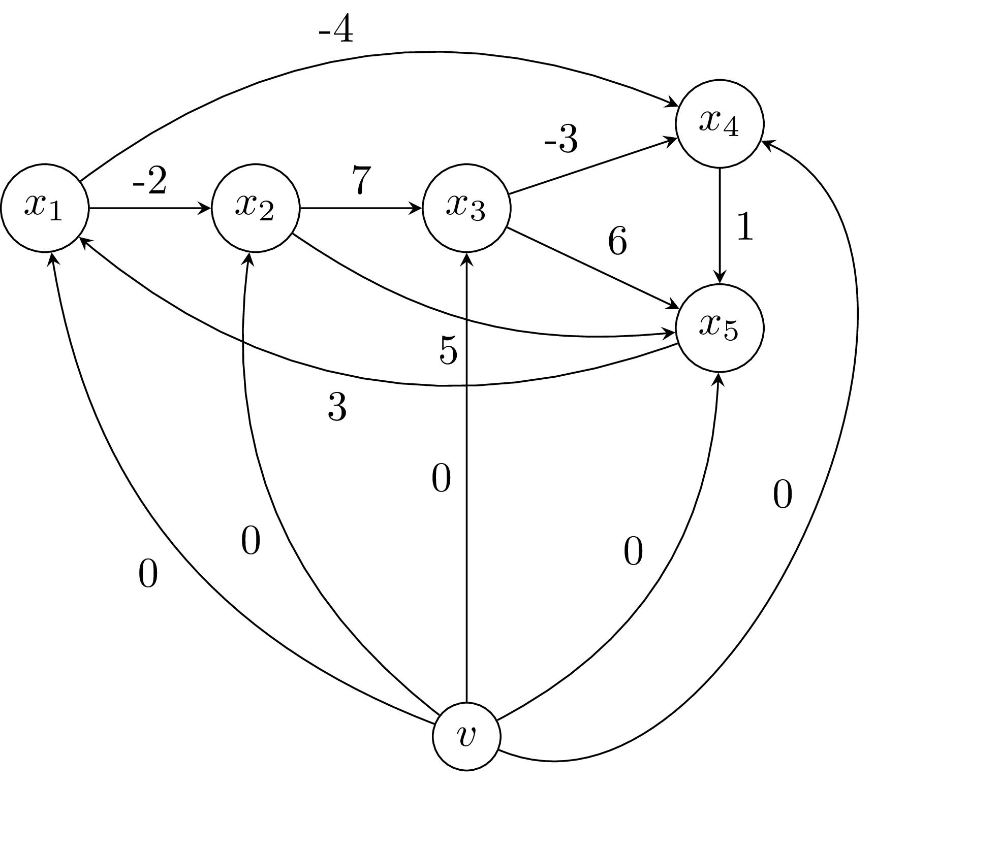
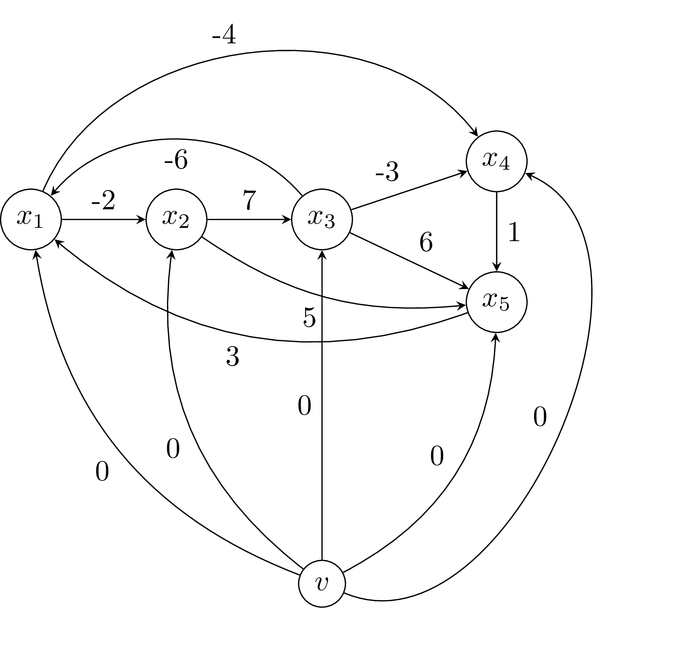

# Χρονοπρογραμματισμός Διαδικασιών

Σκοπός της εργασίας είναι η συγγραφή προγραμμάτων σε γλώσσα Java για την επίλυση προβλημάτων χρονοπρογραμματισμού διαδικασιών.

Έστω ότι υπάρχουν n διαφορετικές διαδικασίες: 
```
x[0], x[1], ..., x[n-1]
```

Οι διαδικασίες αυτές υπόκεινται σε `m` περιορισμούς όσον αφορά το χρόνο έναρξής τους. Οι περιορισμοί είναι της μορφής:
```
x[i] >= x[j] + t[k]
```
όπου `0 <= k <= m-1`. Ο παραπάνω περιορισμός σημαίνει ότι η διαδικασία `x[i]` μπορεί να ξεκινήσει `t[k]` χρονικές περιόδους (π.χ., λεπτά) μετά τη διαδικασία `x[j]` αν `t[k] > 0` ή ότι η διαδικασία `x[i]` μπορεί να ξεκινήσει `t[k]` χρονικές περιόδους πριν τη διαδικασία `x[j]` αν `t[k] < 0`.

Αν θεωρήσουμε ότι ξεκινάμε τη χρονική στιγμή `0`, θέλουμε να βρούμε τις ελάχιστες χρονικές στιγμές έναρξης των διαδικασιών που μας δίνονται. 

Για να λύσουμε το πρόβλημα αυτό, κατασκευάζουμε ένα γράφο ο οποίος περιέχει κόμβους που αντιστοιχούν στις διαδικασίες που θέλουμε να προγραμματίσουμε, συν έναν επιπλέον κόμβο:

```
v, x[0], x[1], ..., x[n-1]
```

Οι σύνδεσμοι στο γράφο είναι οι:
```
(v, x[0], 0) 
(v, x[0], 0) 
...
(v, x[n-1], 0) 
```
δηλαδή σύνδεσμοι από τον κόμβο `v` σε κάθε κόμβο του γράφου με βάρος `0` και οι: 
```
(x[i], x[j], -t[k])
```
δηλαδή ένας σύνδεσμος για κάθε περιορισμό με βάρος τo αντίθετο της τιμής της χρονικής περίοδου που υπεισέρχεται στον περιορισμό. 

Στον γράφο που κατασκευάστηκε τρέχουμε τον αλγόριθμο Bellman-Ford (δεδομένου ότι μπορεί να έχει αρνητικά βάρη) για να βρούμε τα συντομότερα μονομάτια από τον κόμβο `v` στους υπόλοιπους κόμβους του γράφου. Αν τα συντόμερα μονοπάτια που θα βρεθούν έχουν μήκη:
```
(0, y[0], y[1], ..., y[n-1])
```
τότε οι αριθμοί:
```
y[0], y[1], ..., y[n-1]
```
είναι μια λύση στο πρόβλημά μας, ώστε η διαδικασία `0` μπορεί να ξεκινήσει τη χρονική στιγμή `y[0]`, η διαδικασία `1` μπορεί να ξεκινήσει τη χρονική στιγμή `y[1]`, κ.ο.κ. Επίσης οι αριθμοί:
```
d + y[0], d + y[1], ...,  d + y[n-1]
```
για κάθε `d` αποτελούν επίσης λύση του προβλήματος. Συνεπώς, αν στα:
```
y[0], y[1], ..., y[n-1]
```
υπάρχουν αρνητικές τιμές, αρκεί να προσθέσουμε στη λύση τον αριθμό `d` ίσο με τη μικρότερη αρνητική τιμή για να πάρουμε μια λύση με θετικές τιμές.

## Παράδειγμα 1

Έστω ότι δίνονται οι εξής περιορισμοί:
```
x1 >= x2 + 2
x2 >= x3 - 7
x3 >= x4 + 3
x1 >= x4 + 4
x3 >= x5 - 6
x2 >= x5 - 5
x5 >= x1 - 3
x4 >= x5 - 1
```

Με βάση αυτούς τους περιορισμούς κατασκευάζουμε τον παρακάτω γράφο:



Ο αλγόριθμος Bellman-Ford στο γράφο αυτό με εκκίνηση τον κόμβο `v0` δίνει ως αποτέλεσμα τα ακόλουθα μήκη:
```
x1: 0
x2: -2
x3: 0
x4: -4
x5: -3
```
και άρα μια λύση του προβλήματός μας είναι η:
```
x1: 4
x2: 2
x3: 4
x4: 0
x5: 1
```

που σημαίνει ότι η διαδικασία `x4` μπορεί να ξεκινήσει τη χρονική στιγμή `0`, η διαδικασία `x1` μπορεί να ξεκινήσει `4` χρονικές περιόδους αργότερα όπως επίσης και η διαδικασία `x3`, η διαδικασία `x2` μπορεί να ξεκινήσει `2` χρονικές περιόδους αργότερα και η διαδικασία `x1` δύο χρονικές περιόδους αργότερα.  

## Παράδειγμα 2

Έστω ότι δίνονται οι εξής περιορισμοί:
```
x1 >= x2 + 2
x2 >= x3 - 7
x3 >= x4 + 3
x1 >= x4 + 4
x3 >= x5 - 6
x2 >= x5 - 5
x5 >= x1 - 3
x4 >= x5 - 1
x2 >= x1 + 3
```

Στην περίπτωση αυτή κατασκευάζεται ο παρακάτω γράφος:



Στο γράφο αυτό υπάρχει ο αρνητικός κύκλος `x1 -> x2 -> x3 -> x1`, ο οποίος εντοπίζεται από τον αλγόριθμο Bellman-Ford. Στην περίπτωση αυτή, δεν μπορούμε να βρούμε λύση.

## Απαιτήσεις Προγράμματος

Η εργασία είναι προσωπική.

Κάθε φοιτητής θα εργαστεί στο προσωπικό του αποθετήριο στο GitHub. Για να αξιολογηθεί μια εργασία θα πρέπει να πληροί τις παρακάτω προϋποθέσεις:

1. Όλη η εργασία θα πρέπει να βρίσκεται σε έναν κατάλογο
  ``assignment-4`` μέσα στο αποθετήριο του φοιτητή.

2. Ο πηγαίος κώδικας του προγράμματος που θα γραφτεί θα πρέπει να βρίσκεται
  σε έναν υποκατάλογο ``src`` του καταλόγου ``assignment-4``.

3. Ο μεταγλωττισμένος κώδικας του προγράμματος που θα γραφτεί θα
  πρέπει να βρίσκεται σε έναν υποκατάλογο ``bin`` του καταλόγου
  ``assignment-4``. Έτσι, αν το αποθετήριο του φοιτητή είναι το
  ``example-repo``, η δομή των καταλόγων θα είναι:
    ```
    example-repo
        assignment-4
            src
            bin
    ```
4. Το πρόγραμμα θα πρέπει να έχει όνομα ``DifferenceConstraints``.

5. Το πρόγραμμα θα πρέπει να εκτελείται με τον παρακάτω τρόπο:
```
java DifferenceConstraints example.txt
```
όπου `example.txt` ένα αρχείο κειμένου το οποίο περιέχει τους περιορισμούς με την εξής μορφή:
```
x1 x2 + t1
x1 x3 - t2
...
```
που θα ερμηνεύονται:
```
x1 >= x2 + t1
x1 >= x3 - t2
...
```

***Οι διαδικασίες θα μπορούν να έχουν οποιοδήποτε όνομα***, και όχι απαραίτητα `x1`, `x2`, κ.λπ. 

Στην περίπτωση που υπάρχει λύση στο πρόβλημα, η έξοδος του προγράμματος θα είναι της μορφής:
```
x1: 4
x2: 2
x3: 4
x4: 0
x5: 1
```

***Οι διαδικασίες θα πρέπει να εμφανίζονται στην έξοδο του προγράμματος ταξινομημένες αλφαβητικά***, ακόμα και αν δεν δίνονται έτσι στο αρχείο εισόδου.

Στην περίπτωση που δεν υπάρχει λύση στο πρόβλημα, η έξοδος του προγράμματος θα είναι η:
```
No solution exists
```
Για να ελέγξετε το πρόγραμμά σας μπορείτε να χρησιμοποιήσετε τα αρχεία:

* [example_1.txt](example_1.txt)

* [example_2.txt](example_2.txt)

Αν μια εργασία δεν ικανοποιεί τις παραπάνω απαιτήσεις ***δεν θα είναι δυνατή η αξιολόγησή της***. Επιβεβαιώστε λοιπόν ότι πράγματι το πρόγραμμά σας μπορεί να κληθεί ***ακριβώς*** με τις εντολές που δίνονται παραπάνω, και ότι παράγει ***ακριβώς*** την έξοδο που περιγράφεται.

## Προσοχή

Για την εκπόνηση της εργασίας χρησιμοποιήστε τις τρέχουσες, ενημερωμένες σημειώσεις του μαθήματος όπως αυτές βρίσκονται στο σχετικό ιστότοπο.
